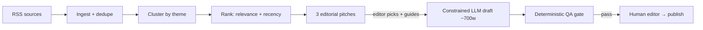

# Newsroom

> A governed AI publishing system: deterministic research, human-guided drafting, and a self-checking quality gate — an AI-run newsroom where a human editor still holds the keys.


Newsroom turns beat-specific RSS research into publish-ready opinion columns through a **governed pipeline**: the parts that must be reliable stay deterministic (research, clustering, ranking, QA), the one part that needs judgment is constrained and human-directed (drafting), and nothing ships without an editor's call.

## Why it's built this way

LLMs are powerful and unaccountable in equal measure. Newsroom's premise is that you don't hand an editorial pipeline to a model and hope — you **govern** it: put the non-negotiable steps under deterministic control, box the generative step in with structure and human direction, and gate the output on checks a model can't hand-wave past. It's a small, honest model of what accountable AI-assisted publishing can look like.

## Pipeline



- **pitch** — deterministic, **$0**, no LLM calls (ingest → cluster → rank → pitch)
- **draft** — LLM-powered but human-guided (the editor picks the pitch and steers the voice)
- **qa** — deterministic gate (sourcing, citations, hedging, voice drift); a draft doesn't pass unless it clears the checks

## Operating Model

Newsroom operates as a sequence of distinct steps. First, the **pitch** step runs deterministically without LLM calls: it ingests RSS sources, clusters articles by theme, ranks them by relevance and timeliness, and generates three one-paragraph pitches. Second, the **draft** step is LLM-powered and human-guided: it takes a selected pitch plus editorial guidance and produces a ~700-word opinion column in the configured writer's voice, retrying if the length drifts outside tolerance. A separate **qa** step then runs the deterministic gate — sourcing, citations, hedging, and voice drift — with no LLM calls. Throughout, the human editor controls which pitch to develop, provides editorial direction, and decides whether to publish.

## Quick Start

```bash
# Install dependencies
uv sync

# Initialize local config from examples
bash scripts/init_config.sh

# See available commands
python -m newsroom --help
```

## Configuration

This repository is **open-core**. Production configuration is intentionally excluded from the public repo.

- **Example configs** live in `config.example/` and are committed to the repo.
- **Runtime configs** live in `config/` and are gitignored.
- Run `scripts/init_config.sh` to generate local config from examples for demo runs.

### Environment Variables

Copy `.env.example` to `.env` and fill in your values:

```
ANTHROPIC_API_KEY=     # Required for draft generation
NEWSROOM_MODEL=        # LLM model ID (default: claude-sonnet-5)
NEWSROOM_NOW=          # Optional: fixed ISO 8601 timestamp for deterministic runs
```

## Project Structure

```
config.example/     Example configs (committed)
config/             Runtime configs (gitignored)
docs/               Architecture docs, ADRs, PRDs
fixtures/           Test fixtures (sanitized RSS, expected outputs)
scripts/            Verification and config scripts
src/newsroom/       Python package
tests/              Unit, integration, and e2e tests
```

## Stack

Python 3.12+, uv, Ruff, pytest, Pydantic, feedparser, httpx, rich, anthropic SDK, scikit-learn, NumPy, PyYAML, python-dotenv.

## Testing & CI

Every change runs through `scripts/verify.sh` (lint + format check + tests) and a CI gate on every pull request. The suite is a full pyramid — unit, integration, and **real end-to-end** tests that drive the CLI as a subprocess over fixtures — and it runs at **$0**: the LLM draft step is exercised through a fake provider behind a test-only seam, and a no-network test policy blocks real API calls.

```bash
bash scripts/verify.sh          # lint, format check, tests
bash scripts/verify_content.sh  # content verification: pitch output vs. golden fixture
uv run pytest tests/ -v         # tests only
```

## Documentation

- `docs/architecture.md` — system design and module overview
- `docs/decisions.md` — recorded design decisions (ADR-style)
